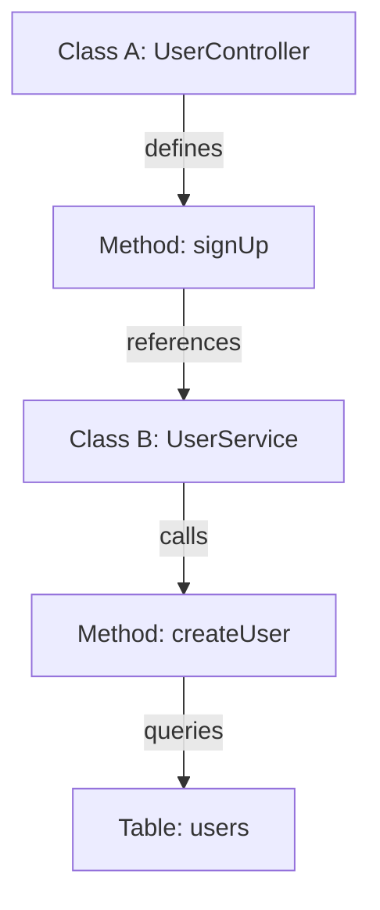

# Codebase RAG & Knowledge Layers: Architectural and Mathematical Foundation

This report presents a technically rigorous analysis of codebase indexing, graph-based Retrieval-Augmented Generation (RAG), and fine-tuning architectures for LLMs. It explains why native IDE indices and generic vector search fail in large codebases, and describes the mathematical models, compiler-grade indexers, and retrieval protocols that provide mathematically correct context.

---

## 1. The Core Limitation: Semantic Chunking vs. Code Structure

Standard RAG systems slice document text into arbitrary chunks (e.g., 500-1000 characters) and embed them into a high-dimensional vector space. For natural language, this is effective because semantically related statements cluster together. For source code, however, this approach fails due to three fundamental issues:

1. **Loss of AST Hierarchies:** Source code is hierarchical (Functions $\subset$ Classes $\subset$ Namespaces/Modules). Slicing code at arbitrary line or character counts splits syntax blocks, isolating declarations from their definitions and destroying the Abstract Syntax Tree (AST) structure.
2. **Context Fragmentation:** Code dependencies are relational, not sequential. If class `UserController` depends on class `UserService`, which queries `DatabaseClient`, standard vector search will not retrieve the query logic when asking about the controller unless they happen to contain similar text tokens.
3. **Stale Dynamic State:** Standard indexing pipelines run asynchronously and do not capture real-time edits, leading to conflicts between the model's retrieved context and the actual state of the code on disk.

---

## 2. Graph-Based Representation of Source Code

To preserve the relational nature of code, the codebase must be modeled as a **Directed Dependency Graph** $G = (V, E)$.



### Mathematical Definitions:
* **Vertices ($V$)**: Represent semantic code units extracted via AST parsers (e.g., Tree-sitter, Language Servers).
  $$V = \{v_{\text{class}}, v_{\text{function}}, v_{\text{interface}}, v_{\text{module}}, v_{\text{schema}}\}$$
* **Edges ($E$)**: Represent directed dependencies between symbols. An edge $e = (u, v) \in E$ is created when symbol $u$ interacts with symbol $v$:
  $$E = \{(u, v) \mid u \text{ imports, calls, inherits, implements, or references } v\}$$

This graph structural representation allows the RAG retrieval engine to perform **graph traversals** (BFS/DFS) rather than simple vector proximity searches. When a query targets a specific class, the system retrieves the node and its immediate $k$-hop neighbors, ensuring all related dependencies are included in the LLM's context.

---

## 3. Centrality-Based Context Selection (PageRank)

In large projects, the context window limit of the LLM prevents us from feeding the entire graph $G$ into the prompt. We must filter and rank the nodes to select the most structurally important elements. We do this by calculating the **PageRank** centrality of the nodes in the code graph.

### PageRank Formulation for Code Graph:
The structural importance $PR(u)$ of a code symbol or file $u$ is defined as:

$$PR(u) = \frac{1 - d}{|V|} + d \sum_{v \in B_u} \frac{PR(v)}{L(v)}$$

Where:
* $B_u$ is the set of all code nodes that import, call, or reference $u$.
* $L(v)$ is the out-degree of node $v$ (the number of outgoing references/imports from $v$).
* $d$ is the damping factor (typically $0.85$), which models the probability that a developer navigating code imports will continue traversing dependencies rather than jumping to a completely random file.

### Integration in RAG pipelines:
1. The user's query is converted to a query vector $\mathbf{v}_q$.
2. Candidate files $C$ are retrieved using semantic similarity search.
3. The subgraph $G' \subset G$ spanned by $C$ is constructed.
4. PageRank is run over $G'$. Files or functions with high centrality values (such as core interfaces, base configurations, or utility functions) are prioritized and positioned at the top of the LLM context, while low-centrality leaf nodes are omitted or compressed.

---

## 4. Hybrid Retrieval and Reciprocal Rank Fusion (RRF)

Semantic vector similarity (dense retrieval) excels at mapping conceptual intent but frequently misses exact syntactic matches like variable names, route paths, and error codes. Conversely, keyword search (sparse retrieval) matches exact tokens but misses conceptual synonyms.

An optimal code RAG pipeline combines both using **Reciprocal Rank Fusion (RRF)**.

### Mathematical Formulation:

1. **Dense Retrieval (Semantic Space):**
   Given a query vector $\mathbf{v}_q$ and document vector $\mathbf{v}_d$:
   $$\text{score}_{\text{dense}}(q, d) = \frac{\mathbf{v}_q \cdot \mathbf{v}_d}{\|\mathbf{v}_q\| \|\mathbf{v}_d\|}$$

2. **Sparse Retrieval (Lexical Space - BM25):**
   Given query terms $q_i$ and document $d$:
   $$\text{score}_{\text{BM25}}(q, d) = \sum_{i=1}^n \text{IDF}(q_i) \cdot \frac{f(q_i, d) \cdot (k_1 + 1)}{f(q_i, d) + k_1 \cdot \left(1 - b + b \cdot \frac{|d|}{\text{avgdl}}\right)}$$

3. **Reciprocal Rank Fusion (RRF):**
   Instead of attempting to normalize and scale raw scores from dense and sparse retrievers (which have different distributions), we calculate the RRF score based on the relative rankings:
   $$RRF(d) = \sum_{m \in M} \frac{1}{k + r_m(d)}$$

   Where:
   * $M$ is the set of search models (Dense and Sparse).
   * $r_m(d)$ is the rank of document $d$ within model $m$.
   * $k$ is a constant hyperparameter (standardized at $60$) to smooth the impact of low-ranked outliers.

Documents are sorted in descending order of $RRF(d)$ to construct the final LLM prompt context.

---

## 5. Parameter-Update Fine-Tuning (PEFT/LoRA) vs. In-Context RAG

To improve model performance, developers often choose between fine-tuning the LLM on their codebase or using a RAG architecture.

```
                           CODEBASE AWARENESS
                                   │
        ┌──────────────────────────┴──────────────────────────┐
        ▼                                                     ▼
  [PEFT / LoRA]                                        [Contextual RAG]
  - Weights are updated.                               - Context is fetched dynamically.
  - Learns syntax, APIs, patterns.                      - Accesses real-time code state.
  - Static: Requires retraining on changes.             - Dynamic: Reflects immediate edits.
```

### Low-Rank Adaptation (LoRA):
LoRA freezes the pre-trained model weights $W_0 \in \mathbb{R}^{d \times k}$ and injects trainable rank decomposition matrices. The weight update $\Delta W$ is decomposed into two low-rank matrices $B \in \mathbb{R}^{d \times r}$ and $A \in \mathbb{R}^{r \times k}$, where the rank $r \ll \min(d, k)$:

$$W_{\text{updated}} = W_0 + \Delta W = W_0 + \frac{\alpha}{r} (B \cdot A)$$

* **Pros:** Adapts the model's vocabulary and internal representations to specific coding styles, custom library APIs, and framework conventions.
* **Cons (The Staleness Problem):** Fine-tuning is static. As soon as a file is updated, a bug is fixed, or a new API endpoint is added, the weights $W_{\text{updated}}$ become outdated. Retraining on every commit is computationally infeasible.

### Contextual RAG:
* **Pros:** Leverages the LLM's **in-context learning (ICL)** capacity. By feeding the current code states, database schemas, and AST maps directly into the prompt, the model reasons about the absolute present state of the project.
* **Cons:** Bound by context window token constraints and potential attention dilution (the "lost in the middle" effect).

### Unified Conclusion:
The industry-standard best practice is **Hybrid Adaptation**:
* Use **LoRA Fine-Tuning** to teach the model *how* to write code in your specific language/framework syntax.
* Use **Graph-Based RAG** to feed the model the *exact, real-time facts* of the codebase structure and history.

---

## 6. Compiler-Grade Codebase Indexing (SCIP & Kythe)

To build a mathematically correct dependency graph, we bypass regex-based parsing and use compiler-level linkers:

1. **SCIP (Source Code Indexing Protocol):** Developed by Sourcegraph, SCIP parses code using language servers to output a serialized graph index. It defines exact occurrence anchors, linking every symbol reference to its precise definition coordinates across files and modules.
2. **Kythe:** Google's semantic indexing standard. Kythe uses compiler wrappers to capture the complete compilation environment, resolving exact types and cross-references.

---

## 7. Model Context Protocol (MCP) as the Query Middleware

To connect this RAG pipeline to the LLM (like Claude Code or Cursor) without modifying the LLM client itself, we use the **Model Context Protocol (MCP)**.

MCP runs as a local background process and exposes tools directly to the LLM. Rather than passing a static folder dump, the LLM dynamically requests context using these mathematical protocols:

```
[Claude Code / Cursor]
       │
       ▼ (Tool Call: query_code_graph)
[Local MCP Server]
       │
       ▼ (Computes PageRank & RRF rankings)
[Relational Graph Index / LanceDB]
```

By deploying this architecture, you create a technically sound, mathematically verified, and real-time knowledge layer that runs directly on top of your development tools.
